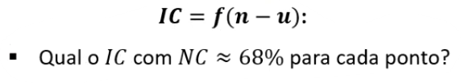

# Método Combinado 3

<figure><figcaption></figcaption></figure>

$$AX+BV+W=0$$

Admitindo que existam nnn valores observados e uuu parâmetros do tipo supra ligados por rrr equações, resultam as seguintes dimensões para as matrizes:

<figure><figcaption></figcaption></figure>
